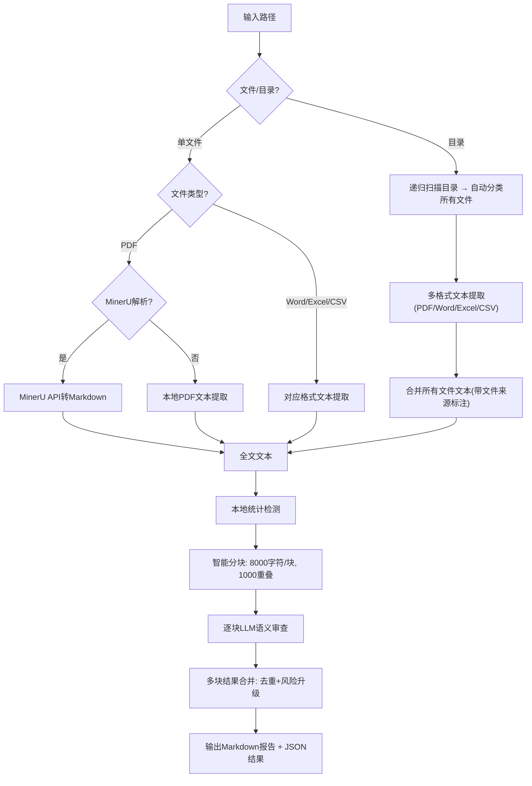

# 📄 Paper Audit - 耿同学版学术论文自动审查工具

> 开箱即用的学术造假检测工具，融合3大开源项目思路 + MinerU OCR + LLM语义分析，一键生成专业审查报告。

<div align="center">


</div>

---

## ✨ 核心特性
### 🎯 检测体系（耿同学标准）
融合3大开源项目的核心检测逻辑：
- ✅ [wooly99/geng-academic-fraud-detector](https://github.com/wooly99/geng-academic-fraud-detector) 耿同学六式检测
- ✅ [NeoSpecies/AcademicIntegrityHunter](https://github.com/NeoSpecies/AcademicIntegrityHunter) 本地统计算法（Benford分布校验、p值异常检测、数字自洽性分析）
- ✅ [jingshouyan/academic-integrity-geng](https://github.com/jingshouyan/academic-integrity-geng) 五维审查体系

### 🔧 技术特性
- 📁 **目录级综合审查**：传入论文目录，自动识别PDF/Word/Excel/补充材料/原始数据，跨文件交叉验证
- 📝 **MinerU PDF解析**：支持原生PDF/扫描件/图片PDF转Markdown，保留表格、公式、图片标注
- 📚 **长论文冗余审查**：智能分块（8000字符/块+1000字符重叠）+ 多块结果合并，无信息丢失
- ⚡ **双引擎检测**：本地统计检测（无API调用）+ LLM语义分析（Mimo模型）
- 📊 **结构化输出**：美观的Markdown报告 + 原始JSON结果导出
- 🔒 **隐私友好**：本地文件可选免Token的MinerU Agent API，无需上传到第三方训练集
- 🧠 **社区驱动知识库**：内置12+种从PubPeer典型案例汇总的造假检测模式，支持社区贡献自动更新

---

## 🚀 快速开始
### 1. 安装依赖
```bash
pip install -r requirements.txt
```

<details>
<summary>📋 依赖详情</summary>

| 依赖 | 用途 | 必需 |
|------|------|------|
| Python ≥ 3.10 | 运行环境 | ✅ 必需 |
| python-docx ≥ 0.8.11 | 读取Word文档(.docx) | 📁 目录审查时需要 |
| openpyxl ≥ 3.1.0 | 读取Excel表格(.xlsx/.xlsm) | 📁 目录审查时需要 |
| lxml ≥ 4.9.0 | python-docx的XML解析依赖 | 📁 目录审查时需要 |

> 💡 纯PDF审查仅需Python标准库，无额外依赖。目录级多格式审查需安装上述可选依赖。

</details>

### 2. 配置API Key
本工具支持所有**OpenAI兼容LLM**（OpenAI/DeepSeek/通义千问/豆包/Ollama本地部署等），采用外部配置文件避免泄露密钥：
```bash
# 复制配置模板
cp config.example.py config.py
```
编辑`config.py`填写你的配置：
#### LLM配置（必填，支持所有OpenAI兼容API）
```python
# 示例1: OpenAI官方
LLM_API_KEY = "sk-xxxxxx"
LLM_API_URL = "https://api.openai.com/v1/chat/completions"
LLM_MODEL = "gpt-3.5-turbo"

# 示例2: DeepSeek
# LLM_API_KEY = "sk-xxxxxx"
# LLM_API_URL = "https://api.deepseek.com/v1/chat/completions"
# LLM_MODEL = "deepseek-chat"

# 示例3: 本地Ollama（完全离线）
# LLM_API_KEY = "ollama"
# LLM_API_URL = "http://localhost:11434/v1/chat/completions"
# LLM_MODEL = "qwen2:7b"
```
#### MinerU配置（可选）
- 小文件（≤10MB/≤20页）：无需配置，自动使用内置免Token的Agent API
- 大文件（>10MB/>20页）：到[MinerU官网](https://mineru.net/apiManage/docs)获取Token填写即可
```python
MINERU_TOKEN = "你的MinerU Token（可选）"
```

### 3. 运行检测
```bash
# 🆕 新功能：审查整个论文项目目录（自动识别主论文/补充材料/原始数据/表格，跨文件交叉验证）
python paper_audit.py ./my_paper_project/ --mineru

# 推荐：单个PDF文件MinerU解析 + 完整检测
python paper_audit.py your_paper.pdf --mineru

# 仅原始PDF文本提取 + 检测
python paper_audit.py your_paper.pdf

# 自定义输出
python paper_audit.py your_paper.pdf --mineru -o report.md --json

# 更新欺诈模式知识库（从PubPeer评论/造假案例文本中提取新检测模式）
python paper_audit.py --update-patterns pubpeer_comments.txt
```

---

## 🤝 社区贡献知识库
本工具内置的欺诈模式知识库基于PubPeer公开案例和社区贡献构建，欢迎所有人参与共建：
1. 收集PubPeer上的公开造假案例评论/描述，保存为纯文本文件
2. 运行`--update-patterns`命令自动提取新的检测模式
3. 提交PR到本仓库，审核通过后会合并到公共知识库，所有人都能受益

---

## 📖 完整用法
```
usage: paper_audit.py [-h] [--mineru]
                      [--mineru-model {pipeline,vlm,MinerU-HTML}]
                      [--mineru-lang MINERU_LANG] [--no-mineru]
                      [--max-chars MAX_CHARS] [--output OUTPUT] [--json]
                      pdf_path

positional arguments:
  pdf_path              待审查的文件路径或论文目录路径（支持PDF/Word/Excel/Supplement等）

options:
  -h, --help            show this help message and exit
  --mineru              使用MinerU API将PDF转为Markdown再审查（推荐，质量更高）
  --mineru-model        MinerU模型版本（默认vlm，仅Precision API生效）
  --mineru-lang         MinerU OCR语言（默认ch=中英，en=英文，japan=日文）
  --no-mineru           强制使用原始PDF文本提取，禁用MinerU
  --max-chars           单块最大字符数（默认8000）
  --output, -o          输出报告文件路径（默认输出到同目录）
  --json                同时保存原始JSON结果
```

---

## 📊 报告示例
```
# 📄 学术论文审查报告 [耿同学标准]
**文件**: `test_paper.pdf`
**文件大小**: 3.2 MB
**提取字符数**: 23456
**提取方式**: MinerU VLM
**审查方式**: 分块审查 | 3块 | 单块上限8000字符 | 重叠1000字符
**审查时间**: 2026-05-22 15:30:00

## 📊 本地统计检测结果
| 检测项 | 结果 | 状态 |
|--------|------|------|
| Benford分布偏差 | 0.123 | ✅正常 |
| p值数量/异常 | 12 / 2个>0.05 | ⚠️异常 |
| 标准差提及 | 4处 | N/A |
| 提取数字数 | 234 | - |

## 总评: 存在多处统计异常，判定为中风险
**风险等级**: 🟡 中
**打假得分**: 72 (越高越可疑)

## 🔍 逐项检查
| # | 分类 | 检查项 | 判定 |
|---|------|--------|------|
| 1 | 数据与结果 | p值未做多重比较校正 | 🚩红旗 |
| 2 | 图片与图表 | Figure 2与Figure 3背景高度相似 | ⚠️疑点 |
| 3 | 方法论 | 样本量n=12不足以支撑统计结论 | 🚩红旗 |
```

---

## 🧠 工作原理


---

## 🙏 鸣谢
本项目检测体系融合参考以下优秀开源项目：
- [wooly99/geng-academic-fraud-detector](https://github.com/wooly99/geng-academic-fraud-detector) - 耿同学六式检测框架
- [Neospecies/AcademicIntegrityHunter](https://github.com/Neospecies/AcademicIntegrityHunter) - 本地统计检测算法
- [jingshouyan/academic-integrity-geng](https://github.com/jingshouyan/academic-integrity-geng) - 五维审查体系

感谢 [LINUX DO 社区](https://linux.do/) 提供的技术交流与支持。

---

## ⚠️ 免责声明
本工具仅供学术研究使用，所有检测结果仅为参考，不构成任何学术不端的判定依据。请严格遵守相关法律法规和学术规范，禁止将本工具用于任何非法用途。

---

## 🤝 贡献
欢迎提交Issue和PR！参考方向：
- 增加本地LLM支持
- 更多统计检测维度
- 批量检测功能
- 图形界面开发

---

## 📄 许可证
MIT License
